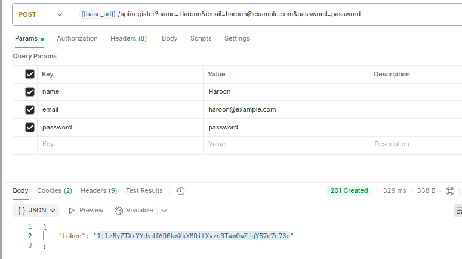
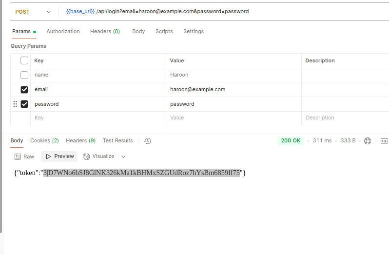
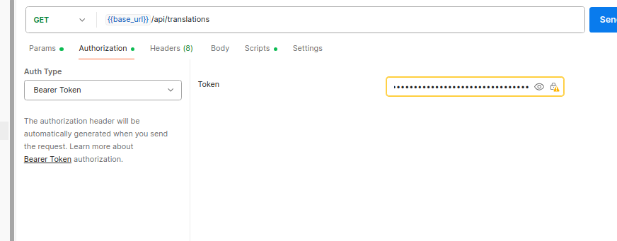
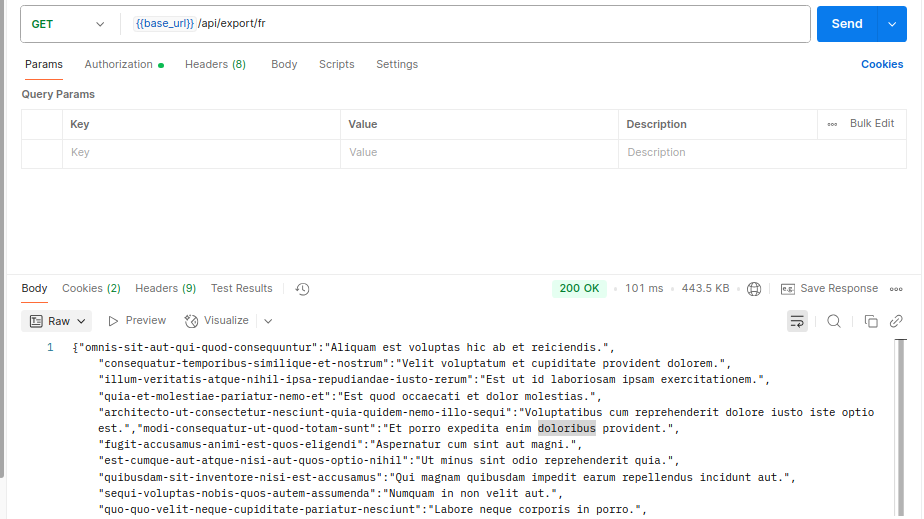
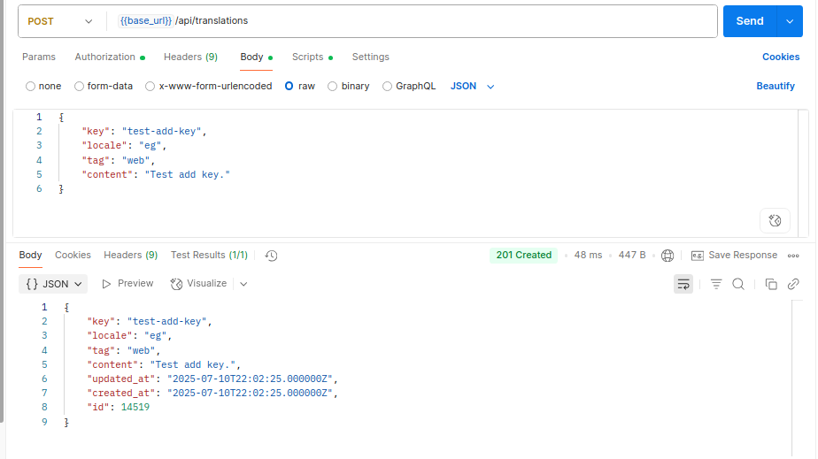
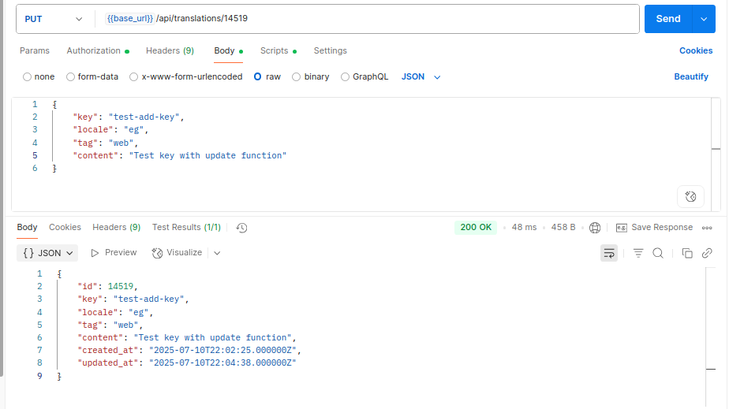
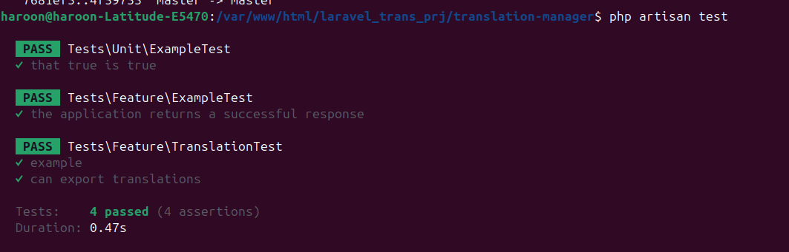

# Translation Management Service	 🚀

API-driven service

## Features

✔️ Store translations for multiple locales (e.g., en , fr , es ) with the ability to add new
languages in the future.
✔️ Tag translations for context (e.g., mobile , desktop , web ).
✔️ Expose endpoints to create, update, view, and search translations by tags, keys, or
content.
✔️ Provide a JSON export endpoint to supply translations for frontend applications like
Vue.js.
✔️ Json endpoint should always return updated translations whenever requested.

## Tech Stack

- **Backend:** PHP 8.2, Laravel 10  
- **Database:** MySQL 8  
- **Auth:** Laravel Sanctum  

## Getting Started

### Installation

git clone git@github.com:haroonurasheed/translation-mgmt-srv.git

cd [repo]

# Install Composer dependencies
composer install

### Environment Setup

cp .env.example .env

php artisan key:generate

Edit `.env` and set your database credentials:

DB_CONNECTION=mysql

DB_HOST=127.0.0.1

DB_PORT=3306

DB_DATABASE=your_db

DB_USERNAME=your_user

DB_PASSWORD=your_pass

### Database Migrations & Seeding

1. Run migrations

   php artisan migrate

2. Seed initial data

   # Run all seeders
   php artisan db:seed

## Usage

php artisan serve  

## Screenshots step by step

1- Register user

2- Login user and get token

2.2- Use token as bearer token in all APIs for Authorization, like below screenshot

3- Get translation details

4- Export all translations on basis of locals

5- Add new translation

6- Update translation

### 🧪 **Unit Testing & Coverage**

These tests are built to ensure the reliability, performance, and correctness of the core translation APIs. The testing suite is written using **PHPUnit** and fully supports Laravel's built-in testing tools. It includes **Feature tests** for endpoint behavior and **Unit tests** for business logic.

### 📌 **POSTMAN API Collection:**

👉 [Download Postman Collection](screenshots/Translation_Service.postman_collection.json)

### 📌 **Note:**

These APIs are designed to be easily integrated with modern frontend frameworks such as **Vue.js**, **React**, **Angular**, and others. They return responses in **JSON format**, making it straightforward to consume and display data on the frontend. Additionally, the API endpoints follow RESTful standards, which ensures compatibility with a wide range of frontend and mobile applications.

